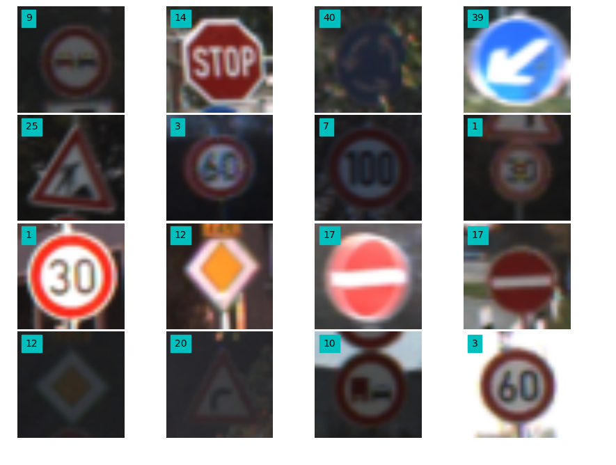

# **Traffic Sign Recognition** 

## Ariel Nunez

---

**Build a Traffic Sign Recognition Project**

The goals / steps of this project are the following:
* Load the data set (see below for links to the project data set)
* Explore, summarize and visualize the data set
* Design, train and test a model architecture
* Use the model to make predictions on new images
* Analyze the softmax probabilities of the new images
* Summarize the results with a written report

[//]: # (Image References)

[image1]: ./examples/visualization.jpg "Visualization"
[image2]: ./examples/grayscale.jpg "Grayscaling"
[image3]: ./examples/random_noise.jpg "Random Noise"
[image4]: ./examples/placeholder.png "Traffic Sign 1"
[image5]: ./examples/placeholder.png "Traffic Sign 2"
[image6]: ./examples/placeholder.png "Traffic Sign 3"
[image7]: ./examples/placeholder.png "Traffic Sign 4"
[image8]: ./examples/placeholder.png "Traffic Sign 5"

## Rubric Points

---
### Writeup / README

####1 . Provide a Writeup / README that includes all the rubric points and how you addressed each one. You can submit your writeup as markdown or pdf. You can use this template as a guide for writing the report. The submission includes the project code.

This is the README and is hosted on Github along with the project code. http://github.com/ingenieroariel/CarND-Traffic-Sign-Classifier-Project/blob/master/Traffic_Sign_Classifier.ipynb

### Data Set Summary & Exploration

#### 1. Provide a basic summary of the data set and identify where in your code the summary was done. In the code, the analysis should be done using python, numpy and/or pandas methods rather than hardcoding results manually.

Data exploration has been done on cell #3. The code used to plot it was based on code from Vivek Yadav.

* The size of training set is 34799
* The size of test set is 12630
* The shape of a traffic sign image is (32, 32, 3)
* The number of unique classes/labels in the data set is 43

#### 2. Include an exploratory visualization of the dataset and identify where the code is in your code file.

The code for this step is contained in the third code cell of the IPython notebook.  

Here is an exploratory visualization of the data set. It is random images from the dataset.

 

###Design and Test a Model Architecture

####1. Describe how, and identify where in your code, you preprocessed the image data. What tecniques were chosen and why did you choose these techniques? Consider including images showing the output of each preprocessing technique. Pre-processing refers to techniques such as converting to grayscale, normalization, etc.

No preprocessing.

I tried normalizing with the mean and standard deviation and using grayscale and the benefit was minimal compared to just adding more data. The network I am using takes the three channels so going to grayscale is not needed. The image values are between 0 and 255 in all the cases, so it can be argued that they are already in a range friendly for the computer, just not between -1 and 1. 

####2. Describe how, and identify where in your code, you set up training, validation and testing data. How much data was in each set? Explain what techniques were used to split the data into these sets. (OPTIONAL: As described in the "Stand Out Suggestions" part of the rubric, if you generated additional data for training, describe why you decided to generate additional data, how you generated the data, identify where in your code, and provide example images of the additional data)

Training: 382789 (10 times original with data augmentation)
Validation: 12630 (original)
Testing: 12630 (original)

The data was already split in training, validation and testing. It is loaded in Cell #0.

The fourth code cell of the IPython notebook contains the code for augmenting the data set. I decided to generate additional data because I wanted to avoid overfitting. The data augmentation routine was designed as an OpenCV port of the functions that Vivek Yadav had defined, using OpenCV instead of just numpy had a large benefit in image quality of the augmented dataset.

The data augmentation techniques done were Rotation, Translation, Shear and Brightness. I created 10 times more data using this technique.

#### 3. Describe, and identify where in your code, what your final model architecture looks like including model type, layers, layer sizes, connectivity, etc.) Consider including a diagram and/or table describing the final model.

The code for my final model is located in the eigth cell of the ipython notebook. 

My final model is exactly LeNet, using 32x32x3 RGB as input and a fully connected layer at the end of input 84 and output 43.

#### 4. Describe how, and identify where in your code, you trained your model. The discussion can include the type of optimizer, the batch size, number of epochs and any hyperparameters such as learning rate.

The code for training the model is located in the eigth cell of the ipython notebook. 

To train the model, I used an Adam optimizer, with a target function of reducing the mean of a softmax crossentropy.

#### 5. Describe the approach taken for finding a solution. Include in the discussion the results on the training, validation and test sets and where in the code these were calculated. Your approach may have been an iterative process, in which case, outline the steps you took to get to the final solution and why you chose those steps. Perhaps your solution involved an already well known implementation or architecture. In this case, discuss why you think the architecture is suitable for the current problem.

Training started out at around 80% accuracy but jumped to 92% accuracy in the first epoch when using the data augmentation.

My final model results were:

* training set accuracy of 99.9%
* validation set accuracy of 96% 
* test set accuracy of 94%

If an iterative approach was chosen:
* What was the first architecture that was tried and why was it chosen?
LeNet, it was chosen because it was used to solve the same problem in the past and what I really wanted to prove was if I was able to correctly connect it to a different problem (with respect to the LeNet lab).
* What were some problems with the initial architecture?
None, it was awesome.
* How was the architecture adjusted and why was it adjusted? Typical adjustments could include choosing a different model architecture, adding or taking away layers (pooling, dropout, convolution, etc), using an activation function or changing the activation function. One common justification for adjusting an architecture would be due to over fitting or under fitting. A high accuracy on the training set but low accuracy on the validation set indicates over fitting; a low accuracy on both sets indicates under fitting.
It was not adjusted.
* Which parameters were tuned? How were they adjusted and why?
Epochs was first increased from 20 to 50 and it stopped around iteration 15. Batch sized was changed from 128 to 1024 but it started learning very slowly and going backwards in many of the cases. In the end I stayed with 20 epochs, 128 as batch size and 0.001 as the learning rate.

If a well known architecture was chosen:
* What architecture was chosen? LeNet
* Why did you believe it would be relevant to the traffic sign application? It was suggested by the instructors.
* How does the final model's accuracy on the training, validation and test set provide evidence that the model is working well? A near perfect score on training that could mean overfitting actually gave a decent performance on evaluation.
 

###Test a Model on New Images

####1. Choose five German traffic signs found on the web and provide them in the report. For each image, discuss what quality or qualities might be difficult to classify.

####2. Discuss the model's predictions on these new traffic signs and compare the results to predicting on the test set. Identify where in your code predictions were made. At a minimum, discuss what the predictions were, the accuracy on these new predictions, and compare the accuracy to the accuracy on the test set (OPTIONAL: Discuss the results in more detail as described in the "Stand Out Suggestions" part of the rubric).

The code for making predictions on my final model is located in the tenth cell of the Ipython notebook.

Here are the results of the prediction:

| Image			        |     Prediction	        					| 
|:---------------------:|:---------------------------------------------:| 
| Do not turn right      		| Keep right   									| 
| Stop sign     			| Speed limit 30										|
| Speed limit 30km/h					| Wild animals crossing											|
| Stop sign	      		| Stop sign					 				|
| Speed limit 30km/h			| Speed limit 20km/h

The model only predicted 20% of the images, but this is in a totally new environment.      							|

When testing with German signs, the performance was 40% on the top1 but 100% in top3. Poor performance is mostly due to the images being arbitrarily tall and being converted poorly to 32x32.

####3. Describe how certain the model is when predicting on each of the five new images by looking at the softmax probabilities for each prediction and identify where in your code softmax probabilities were outputted. Provide the top 5 softmax probabilities for each image along with the sign type of each probability. (OPTIONAL: as described in the "Stand Out Suggestions" part of the rubric, visualizations can also be provided such as bar charts)

The code for making predictions on my final model is located in the 64th cell of the Ipython notebook.

On the first image, the model is very certain but is very wrong. The correct answer is the second.

predictions 1
6413.5 | 12 | Priority road
2951.09 | 3 | Speed limit (60km/h)
1788.78 | 37 | Go straight or left
1459.52 | 10 | No passing for vehicles over 3.5 metric tons
3.66716 | 38 | Keep right

On the second image the model is not very certain and has the correct answer as the second.

predictions 2
17734.5 | 17 | No entry
15139.0 | 14 | Stop
11815.6 | 12 | Priority road
140.832 | 3 | Speed limit (60km/h)
-1692.24 | 10 | No passing for vehicles over 3.5 metric tons

On the third image the model is sure and correct. Maybe because the image is a triangle?

predictions 3
17177.3 | 13 | Yield
2051.04 | 5 | Speed limit (80km/h)
454.74 | 12 | Priority road
-1311.21 | 14 | Stop
-1618.57 | 1 | Speed limit (30km/h)

The model is quite sure but wrong, the correct answer is the third.

predictions 4
25682.8 | 18 | General caution
15763.0 | 24 | Road narrows on the right
14660.2 | 27 | Pedestrians
13732.2 | 11 | Right-of-way at the next intersection
3938.87 | 26 | Traffic signals

The model is correct and sure.

predictions 5
23506.7 | 1 | Speed limit (30km/h)
10972.0 | 2 | Speed limit (50km/h)
3457.19 | 5 | Speed limit (80km/h)
-396.838 | 7 | Speed limit (100km/h)
-6068.26 | 25 | Road work

## Final thoughts.

- Using the right model and data augmentation correctly can make the model converge very fast with high accuracy.
- When using RGB images of a small size with an specific bit depth (8-bit) the data normalization is usually done when resizing / changing format. i.e. creating the dataset.
- Poor clipping can affect the performance greatly. May be worth adding a simple object proposals step tuned to these signals before sending to the classifier, that way we can use better the 32x32x3 space at the start of the network.
- Works in the lab, does not work on the road. Not good enough for a self driving car that will be used by my grandmother. Reflects a lot on the performance of current drive assist features that when shipped to Colombia perform very poorly, and the big challenges of the auto industry shipping self driving cars worldwide while testing mostly in USA/Europe. 
